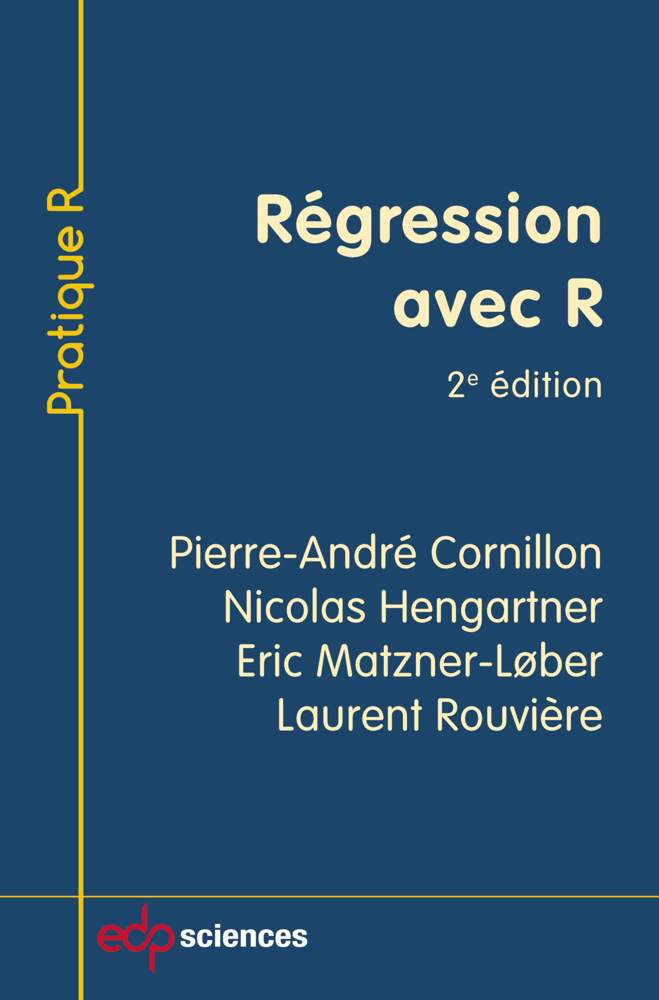
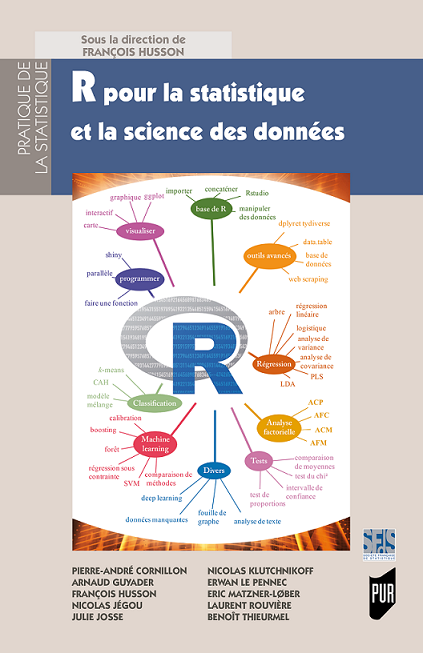
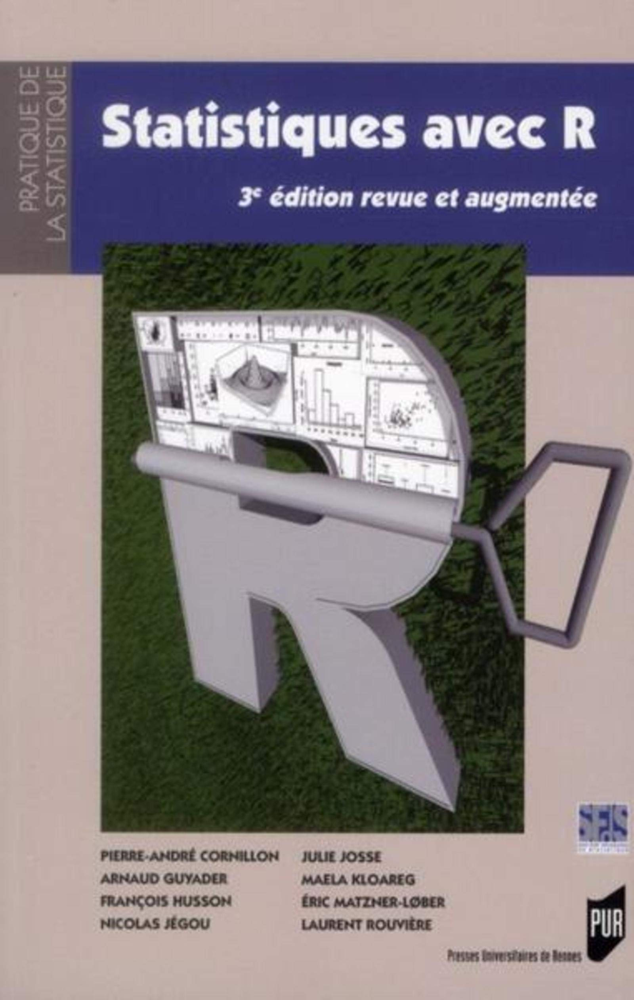

### 

------------------------------------------------------------------------

::: columns
::: {.column width="20%"}
[{width="139"}](https://regression-avec-r.github.io)
:::

::: {.column width="5%"}
:::

::: {.column width="75%"}
-   **Titre** : Régression avec R, 2ème édition, 2019

-   **Auteurs** : [Pierre-André Cornillon](https://perso.univ-rennes2.fr/pierre-andre.cornillon), Nicolas Hengartner, [Eric Matzner-Løber](https://www.researchgate.net/profile/E_Matzner-Lober), [Laurent Rouvière](https://perso.univ-rennes2.fr/laurent.rouviere)

-   **Edition** : EDP sciences

-   **Site Web** : <https://regression-avec-r.github.io>
:::
:::

------------------------------------------------------------------------

::: columns
::: {.column width="20%"}
[{width="137"}](https://r-stat-sc-donnees.github.io)
:::

::: {.column width="5%"}
:::

::: {.column width="75%"}
-   **Titre** : R pour la statistique et la science des données, 2018

-   **Auteurs** : [Pierre-André Cornillon](https://perso.univ-rennes2.fr/pierre-andre.cornillon), [Arnaud Guyader](http://www.lsta.upmc.fr/guyader/), [François Husson](https://husson.github.io/), [Nicolas Jégou](https://perso.univ-rennes2.fr/nicolas.jegou), [Julie Josse](http://juliejosse.com/), [Nicolas Klutchnikoff](https://klutchnikoff.github.io/), [Erwan Le Pennec](http://www.cmap.polytechnique.fr/~lepennec/), [Eric Matzner-Lober](https://www.researchgate.net/profile/E_Matzner-Lober), [Laurent Rouvière](https://perso.univ-rennes2.fr/laurent.rouviere), [Benoît Thieurmel](https://www.linkedin.com/in/benoit-thieurmel-987aa04b/?originalSubdomain=fr)

-   **Edition** : PUR

-   **Site Web** : <https://r-stat-sc-donnees.github.io>
:::
:::

------------------------------------------------------------------------

::: columns
::: {.column width="20%"}
[{width="134"}](https://husson.github.io/StatR.html)
:::

::: {.column width="5%"}
:::

::: {.column width="75%"}
-   **Titre** : Statistiques avec R, 3ème édition, 2012

-   **Auteurs** : [Pierre-André Cornillon](https://perso.univ-rennes2.fr/pierre-andre.cornillon), [Arnaud Guyader](http://www.lsta.upmc.fr/guyader/), [François Husson](https://husson.github.io/), [Nicolas Jégou](https://perso.univ-rennes2.fr/nicolas.jegou), [Julie Josse](http://juliejosse.com/), Maëlla Kloareg, [Eric Matzner-Lober](https://www.researchgate.net/profile/E_Matzner-Lober), [Laurent Rouvière](https://perso.univ-rennes2.fr/laurent.rouviere)

-   **Edition** : PUR

-   **Site Web** : <https://husson.github.io/StatR.html>
:::
:::

------------------------------------------------------------------------

::: columns
::: {.column width="20%"}
{width="138"}
:::

::: {.column width="5%"}
:::

::: {.column width="75%"}
-   **Titre** : R for statistics, 2012

-   **Auteurs** : [Pierre-André Cornillon](https://perso.univ-rennes2.fr/pierre-andre.cornillon), [Arnaud Guyader](http://www.lsta.upmc.fr/guyader/), [François Husson](https://husson.github.io/), [Nicolas Jégou](https://perso.univ-rennes2.fr/nicolas.jegou), [Julie Josse](http://juliejosse.com/), Maëlla Kloareg, [Eric Matzner-Lober](https://www.researchgate.net/profile/E_Matzner-Lober), [Laurent Rouvière](https://perso.univ-rennes2.fr/laurent.rouviere)

-   **Edition** : Chapman & Hall
:::
:::
